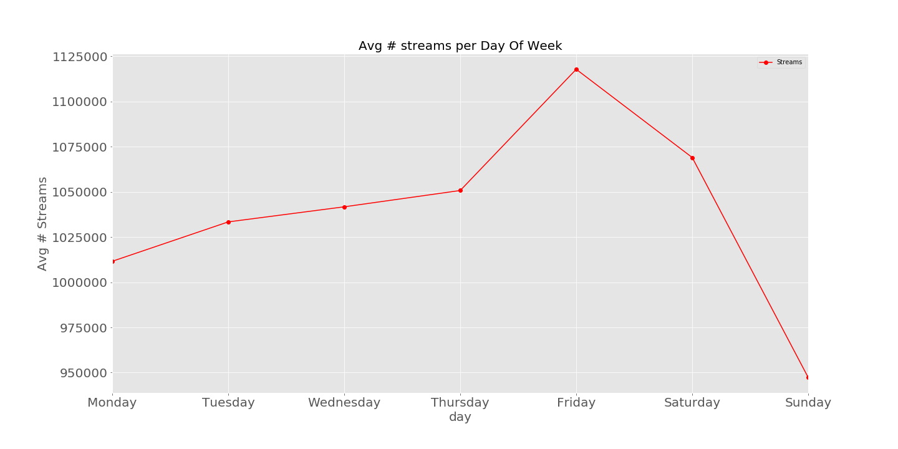

# Forecasting Number of Spotify Streams using Time Series

## Code
* [EDA and Forecasting Notebook](https://github.com/maxgrossenbacher/kaggle_spotify/blob/master/src/Spotify_Time_Series.ipynb) - In this notebook, I forecast the avg. number of streams and the number of streams for the #1 song on Spotify using ARIMA models.
* [Plotting Script](https://github.com/maxgrossenbacher/Forecasting_daily_spotify_streams/blob/master/src/spotify_plot_top_song.py) - script for plotting streams of number one song over time. Run [spotify_data_crawler.py](https://github.com/maxgrossenbacher/Forecasting_daily_spotify_streams/blob/master/src/spotify_data_crawler.py) for up to data Spotify streaming data.
* [Getting Audio Features](https://github.com/maxgrossenbacher/kaggle_spotify/blob/master/src/spotify_data_collection.py) - script for using Spotify API to get audio features of song on Spotify  

## EDA Plots
The United States has the most average daily streams on Spotify.

We can see that number of daily streams are lowest on Sundays and grow gradually throughout the week, peaking on Fridays.

Additionally, if we look at monthly trends we can see that Spotify streams peak in the month of March. This trend may coincide with the fact that in the US most schools have Spring Break in March and during Spring Break the demand for music streaming rises.  

The total number of plays for the number one song on Spotify each day. Line is colored based on track name.  

## Conclusions & Future Directions
We can see that ARIMA models are able to capture the weekly trends in number of daily Spotify streams. Number of daily streams are lowest on Sundays and grow gradually throughout the week, peaking on Fridays.

However, the ARIMA models not very good at forecasting monthly trends of daily number of Spotify streams. Since, this data is only for an 8 month period, the ARIMA models are having a tough time forecasting the monthly underlying signal. A longer period of data would allow the ARIMA models to better capture this signal.  

Some future directions for this project would be to try LSTM neural net to improve the forecasting number of daily streams on Spotify.

## Tech Stack
* Jupyter Notebook
* Pandas
* NumPy
* Matplotlib
* Statsmodels
* TimeSeries - ARIMA
